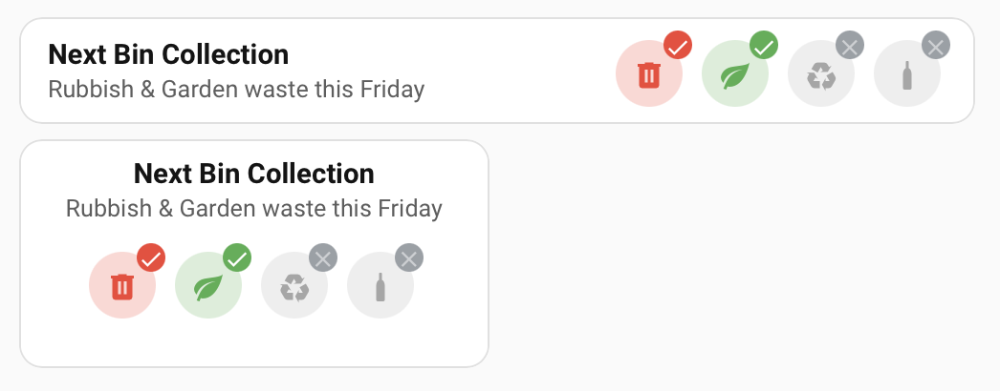

# Wheelie Bun (Bin) Card

[](https://github.com/hacs/integration)

> **Why "Bun"?** New Zealanders pronounce *bin* as *bun*. On collection day a
> Kiwi wheels their buns down the driveway and nobody bats an eyelid. The card is
> named accordingly. She'll be right.

A small Home Assistant Lovelace card for the
[**Waste Collection Schedule**](https://github.com/mampfes/hacs_waste_collection_schedule)
integration (`mampfes/hacs_waste_collection_schedule`). It shows the next
collection as a title + summary line and a row of bin "chips", each with a ✓ or ✗
badge for whether that bin's going out this time — so you know at a glance whether
tonight's the night or whether you can leave the buns where they are.



*Horizontal (default) and vertical layouts, `chip_style: faded`.*

## What you'll need

1. The [Waste Collection Schedule](https://github.com/mampfes/hacs_waste_collection_schedule)
   integration, with a **source** set up for your council.
2. A **sensor** on that source using `details_format: upcoming`. That's the one
   whose attributes are keyed by date:

   ```yaml
   # sensor.waste_collection_schedule attributes
   2026-09-04: "Rubbish, Food scraps, Garden waste"
   2026-09-11: "Recycling, Food scraps, Glass"
   daysTo: 3
   ```

The card reads the earliest of those dates that's today or later. A *calendar*
entity on its own won't cut it, and neither will the `appointment_types` /
`generic` sensor formats — no date-keyed attributes, no dice.

### Adding the sensor

This is the step most people miss — the config flow happily leaves you with just
a calendar, or a sensor in the wrong format.

**GUI:** Settings → Devices & Services → **Waste Collection Schedule** →
**Configure** → add a sensor → set **Details format** to **Upcoming** and
**Count** to something generous like `10`.

**YAML:**

```yaml
waste_collection_schedule:
  sources:
    - name: your_council_source
      args:
        # …council-specific args…
  sensors:
    - name: waste_collection_schedule
      details_format: upcoming   # the default — this is what emits the per-date attributes
      count: 10                  # how many upcoming pickups to list
      # leadtime: 60             # …or cap by number of days instead
```

Then point the card at `sensor.waste_collection_schedule`.

## Getting it installed

### HACS (custom repository)

1. HACS → ⋮ → **Custom repositories** → add
   `https://github.com/Greminn/wheelie-bin-card`, category **Dashboard**.
2. Install **Wheelie Bun (Bin) Card**.
3. HACS adds the resource for you. If it doesn't, add it by hand:
   `/hacsfiles/wheelie-bin-card/wheelie-bin-card.js` (type: `module`).

### Manual (for the DIY crowd)

1. Grab `wheelie-bin-card.js` from the
   [latest release](https://github.com/Greminn/wheelie-bin-card/releases/latest)
   and drop it in `config/www/`.
2. Add a Lovelace resource: `/local/wheelie-bin-card.js` (type: `module`).

## Setting it up

The whole config, if you're not fussy:

```yaml
type: custom:wheelie-bin-card
entity: sensor.waste_collection_schedule_my_council
```

Everything below is optional tinkering.

### Options

| Name | Type | Default | Description |
|---|---|---|---|
| `type` | string | — | `custom:wheelie-bin-card` |
| `entity` | string | — | **Required.** The date-keyed Waste Collection Schedule sensor. |
| `title` | string | `Next Bin Collection` | Card heading. |
| `layout` | `horizontal` \| `vertical` | `horizontal` | `horizontal` = text left, chips right; `vertical` = stacked and centred. |
| `chip_style` | `faded` \| `filled` | `faded` | `faded` = colour icon on a tinted disc; `filled` = white icon on a solid colour disc. |
| `labels` | `english` \| `te-reo` \| `kiwi` | `english` | Language for the built-in bin names — [see below](#bin-names--english-te-reo-or-full-kiwi). Matching stays English. Ignored when `bins` is given. |
| `bins` | list | *(built-in set)* | Override the bin list entirely — [see below](#rolling-your-own-bins). |
| `show_food_scraps` | boolean | `false` | Add a "Food scraps" chip to the built-in set (or just flick it on in the editor). Ignored when `bins` is given. |
| `disabled_bins` | list of slugs | *(none)* | Bins to leave out — e.g. `["glass"]` where there's no glass collection. Works on the built-in set and on a custom `bins` list. |
| `hide_inactive` | boolean | `false` | Only show chips that are part of the next collection. |
| `show_badges` | boolean | `true` | Show the corner ✓ / ✗ badge on each chip. |
| `show_labels` | boolean | `false` | Show each bin's name under its chip. |
| `chip_size` | number \| string | `36` | Chip (circle) diameter — a bare number is px. |
| `icon_size` | number \| string | `22` | Bin icon size — a bare number is px. |
| `badge_size` | number \| string | *(scales with `chip_size`)* | ✓ / ✗ badge diameter — a bare number is px. |
| `chip_gap` | number \| string | `10` | Gap between chips — a bare number is px. |
| `locale` | string | *(HA locale)* | Locale for day names, e.g. `en-NZ`. |
| `tap_action` | action | `more-info` | Standard HA action object. `{ action: none }` disables the click. |
| `hold_action` | action | *(none)* | Standard HA action object. |
| `double_tap_action` | action | *(none)* | Standard HA action object. |

### The visual editor

No need to hand-write YAML like it's 2019. The editor has:

- **Content** — title, **Layout** and **Chip style** as pick-a-picture cards,
  **Bin names** (English / te reo / Kiwi), the show/hide toggles, sizes, locale.
- **Interactions** — tap / hold / double-tap actions.
- **Bins** — one row per bin, where you can:
  - **flick it on or off** — turn Glass off and it's gone (most of Aotearoa has
    no glass bin these days);
  - **drag it by the handle to reorder** — the chips come out in whatever order
    you leave the list;
  - **open the row** to change its icon and colour.

Reorder a bin or change an icon/colour and the editor writes an explicit `bins`
list into your config. **Reset bins to defaults** puts it all back.

### Built-in bin set

Used when you don't supply `bins`:

| slug | label | icon | colour | matches when the collection text contains |
|---|---|---|---|---|
| `rubbish` | Rubbish | `mdi:trash-can` | red | "Rubbish" |
| `garden` | Garden waste | `mdi:leaf` | green | "Garden waste" |
| `recycling` | Recycling | `mdi:recycle` | amber | "Recycling" |
| `glass` | Glass | `mdi:bottle-wine` | blue | "Glass" |

With `show_food_scraps: true` a `food` / "Food scraps" / `mdi:food-apple` /
light-green chip is tacked on the end.

### Bin names — English, te reo, or full Kiwi

`labels` swaps the built-in names. Matching always uses the English term (the
sensor speaks English), so this is completely safe to change.

| slug | `english` | `te-reo` | `kiwi` |
|---|---|---|---|
| `rubbish` | Rubbish | Para | Garbage |
| `garden` | Garden waste | Tapahanga māra | Garden guff |
| `recycling` | Recycling | Hangarua | Cans and cardboard |
| `glass` | Glass | Karaehe | Empties |
| `food` | Food scraps | Para kai | Chook bucket |

**`te-reo`** also swaps the weekday in the summary line — Rāhina, Rātū, Rāapa,
Rāpare, Rāmere, Rāhoroi, Rātapu. The connecting words ("this", "next", "today")
stay English; we'd rather leave the grammar to the experts than mangle it, so
you'll get *"Hangarua & Karaehe this Rāpare"*. Te reo terms follow
[WasteMINZ](https://www.wasteminz.org.nz/our-work/hot-topics/recycling-labels-information)'s
national recycling labels — your local iwi may say it differently.

**`kiwi`** is for when "recycling" feels a bit corporate. Purely cosmetic.

Want your own words? Use `bins` with a custom `label` and an English `match`.

### Dropping bins you don't have

Auckland (and most of the country) binned the glass bin. Get rid of it:

```yaml
type: custom:wheelie-bin-card
entity: sensor.waste_collection_schedule_my_council
disabled_bins: ["glass"]
```

Or just flick the switch in the editor. Works whether you're on the built-in set
or a custom `bins` list.

### Rolling your own bins

```yaml
type: custom:wheelie-bin-card
entity: sensor.waste_collection_schedule_my_council
bins:
  - label: Landfill
    icon: mdi:trash-can
    color: "#e15241"
    match: ["Rubbish", "General waste"]   # any of these substrings ⇒ active
  - label: Recycling
    icon: mdi:recycle
    color: amber
  - label: Organics
    icon: mdi:leaf
    color: green
    match: Garden          # defaults to the label if omitted
```

`color` takes any CSS colour or a Home Assistant colour token name
(`red`, `green`, `blue`, `amber`, `teal`, …).

### CSS custom properties

For when you want to get amongst the styling:

| Property | Default | Purpose |
|---|---|---|
| `--bcc-chip-size` | `36px` | Diameter of each bin chip (or use `chip_size`). |
| `--bcc-icon-size` | `22px` | Bin icon size (or use `icon_size`). |
| `--bcc-badge-size` | scales with chip | ✓ / ✗ badge size (or use `badge_size`). |
| `--bcc-chip-gap` | `10px` | Gap between chips (or use `chip_gap`). |
| `--bcc-chip-bg` | `rgba(150,150,150,0.16)` | Background of an inactive chip. |
| `--bcc-badge-inactive` | `rgba(120,120,120,0.95)` | Background of an inactive chip's badge. |

## Notes

Not affiliated with the Waste Collection Schedule project — it just reads that
integration's sensor. If the card's wrong about your collection day, check the
sensor first; the card only reports what it's told.

**"No upcoming collection data"** on the card means the sensor has no date-keyed
attributes — you're on the wrong sensor, or it needs `details_format: upcoming`.
See [Adding the sensor](#adding-the-sensor).

See [CHANGELOG.md](CHANGELOG.md) for what's changed.

## License

MIT
